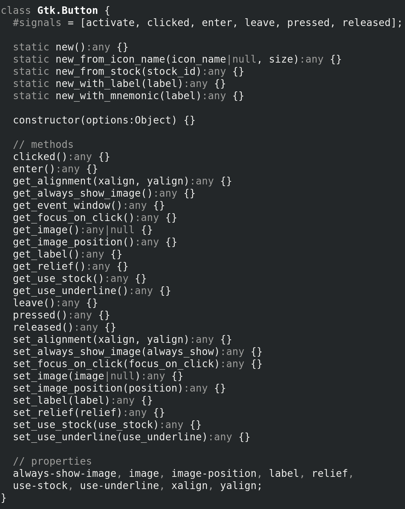

# cgjs-about [](https://opensource.org/licenses/ISC)
An utility to query GJS namespaces

```sh
cgjs-about gi                 # show all namespaes
cgjs-about gi.Gio             # show all gi.Gio info
cgjs-about Gio                # same as above
cgjs-about Gtk.Button         # show Gtk.Button class info
cgjs-about GLib.utf8_validate # show utf8_validate info
cgjs-about GLib enums         # show GLib enums

options:
  --json                      # print JSON output
  --no-arguments              # print JSON without arguments info
```

### Installation

`npm install -g cgjs-about` and a globally available `gjs` is all you need to use this tool.

### Example

`cgjs-about Gtk.Button`

